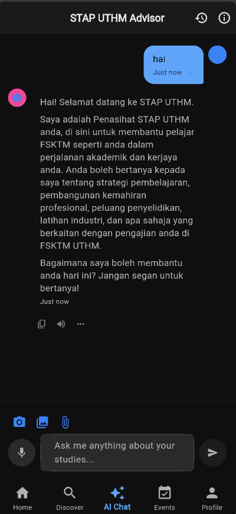
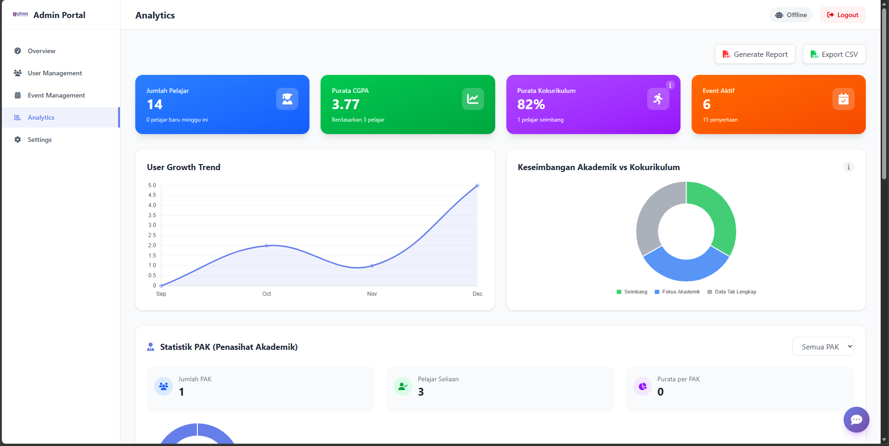

# Student Talent Profiling App - Prototype


End-to-end platform for UTHM student talent profiling that ships a Python FastAPI backend, a Flutter mobile client, and a modern **Astro-based Web Dashboard**.

> **Security first:** this repository ships without secrets. Populate your own `.env` files before running any service and never commit credentials.

## 📖 Table of Contents
- [Highlights](#-highlights)
- [Feature Matrix](#-feature-matrix)
- [Gallery](##-gallery)
- [Repository Layout](#-repository-layout)
- [System Architecture](#-system-architecture)
- [Core Components](#-core-components)
- [Environment & Secrets](#-environment--secrets)
- [Documentation Hub](#-documentation-hub)

## ✨ Highlights
- 📱 **Unified Ecosystem**: Seamless talent profiling across mobile (Flutter) and web (Astro).
- 🤖 **Agentic AI Assistant**: Powered by **Google Gemini** and **LangGraph**, the AI goes beyond chatbots—it executes tools, queries databases, and provides predictive insights in **Bahasa Melayu**.
- 🚀 **Modern Tech Stack**: Supabase (Auth/DB), FastAPI (Backend), Cloudinary (Media), and Astro v5 (Dashboard).
- 📊 **Rich Analytics**: Visualise student risk, achievements, and department performance with Chart.js and automated PDF reporting.

## 🏆 Feature Matrix

| Feature | Description | Status |
| :--- | :--- | :--- |
| **Talent Profiling** | Upload certificates (PDF/Image) & auto-tag skills via Vision AI | ✅ **Production** |
| **Agentic AI** | Voice-enabled Chatbot with local UTHM context (Bahasa Melayu) | ✅ **Production** |
| **Predictive Analytics**| Risk score calculation based on CGPA & participation | 🚧 **Beta** |
| **Smart Reports** | Auto-generate PDF Achievement Reports for Departments | ✅ **Production** |
| **Event Tracker** | QR Code check-ins for events (Kokurikulum) | 🔄 **In Progress** |

## 📸 Gallery

| Mobile App (Home) | AI Chat (Voice) | Web Dashboard (Analytics) |
| :---: | :---: | :---: |
|  |  |  |
| *Student Profile Overview* | *Talking to the Agent in BM* | *Admin Assessment Panel* |

## 📂 Repository Layout
```
prototype/
|-- backend/                # FastAPI application, AI agents (LangGraph), Alembic scripts
|-- mobile_app/             # Flutter app with Supabase auth, showcase, chat, analytics
|-- web_dashboard_astro/    # Admin Dashboard (Astro v5 + Tailwind v4 + TypeScript)
|-- api/                    # Lightweight Vercel serverless handler (health + test endpoints)
|-- assets/                 # Branding assets (cover, logo, favicon)
|-- data/                   # Sample JSON datasets for local testing
|-- docs/                   # Deep-dive guides (architecture, AI upgrades, troubleshooting)
|-- functions/              # Placeholder for cloud functions (ESLint config included)
|-- .github/workflows/      # Deployment pipelines for backend and web dashboard
|-- PRE-COMMIT-CHECKLIST.md # Manual checklist before pushing changes
|-- SECURITY.md             # Security baseline and hardening tips
|-- SETUP.md                # Repository-wide setup walkthrough
```

## 🏗️ System Architecture
```
Supabase Auth + PostgreSQL
          |
          v
FastAPI Backend (backend/) <--- Agentic AI (Gemini + LangGraph)
    |    \
    |     \__ Cloudinary media services
    |
    +--> Flutter Mobile App (mobile_app/)
    |
    +--> Web Dashboard (web_dashboard_astro/)
```

## 🧩 Core Components

### 🐍 Backend (FastAPI + Agentic AI)
- **Framework**: FastAPI with SQLAlchemy ORM and Alembic migrations targeting Supabase PostgreSQL.
- **Agentic AI (`backend/app/ai_assistant/`)**: 
  - Built with **LangGraph** for stateful multi-turn conversations.
  - Features a **Tool Registry** (`tools.py`) for database querying, analytics, and predictive insights.
  - **Bahasa Melayu Default**: Optimized prompts for authentic Malaysian context.
- **Setup**:
  ```bash
  cd backend
  python -m venv .venv
  .venv\Scripts\activate
  pip install -r requirements.txt
  python main.py # Runs on http://localhost:8000
  ```

### 📱 Mobile App (Flutter)
- **Tech**: Flutter (Dart 3.x) with Provider state management.
- **Features**: 
  - Real-time profile updates & certificate uploads (Cloudinary).
  - Voice-enabled AI Chat interface.
  - Student Showcase feed with rich interactions.
- **Setup**:
  ```bash
  cd mobile_app
  flutter pub get
  flutter run
  ```

### 🌐 Web Dashboard (Astro)
- **Tech**: **Astro v5.0**, **TailwindCSS v4.0**, and **TypeScript**.
- **Features**:
  - High-performance, island-architecture based admin portal.
  - **Dynamic Reporting**: Automated PDF generation (`jspdf`) for student achievement reports.
  - **Visual Analytics**: Interactive charts (`chart.js`) for risk and participation tracking.
  - **AI Console**: Direct interface to test and monitor Agentic AI performance.
- **Setup**:
  ```bash
  cd web_dashboard_astro
  npm install
  npm run dev # Runs on http://localhost:4321
  ```

### ⚡ Serverless Edge API
- `api/index.py` exposes a minimal HTTP handler for Vercel-style deployments (health checks, smoke endpoints).

## 🔐 Environment & Secrets
Create `.env` files for each service.

**Backend (`backend/.env`):**
- `SUPABASE_URL`, `SUPABASE_KEY`
- `CLOUDINARY_CLOUD_NAME`, `CLOUDINARY_API_KEY`, `CLOUDINARY_API_SECRET`
- `OPENROUTER_API_KEY` (or Google Gemini API Key)

**Web Dashboard (`web_dashboard_astro/.env`):**
- `PUBLIC_SUPABASE_URL`
- `PUBLIC_SUPABASE_ANON_KEY`

**Mobile App (`mobile_app/assets/.env`):**
- `SUPABASE_URL`, `SUPABASE_ANON_KEY`

## 📚 Documentation Hub
- [SETUP.md](SETUP.md): High-level setup and Supabase configuration.
- [SECURITY.md](SECURITY.md): Hardening checklist and secret management.
- `docs/`:
  - `development/`: Guides on AI architecture, debugging, and performance.
  - `AI_BAHASA_MELAYU_DEFAULT.md`: Guide for the Malay AI implementation.

## 🤝 Contributions
- Follow the `PRE-COMMIT-CHECKLIST.md` before pushing.
- Ensure all secrets are git-ignored.
- Use the `web_dashboard_astro` for all dashboard-related development (legacy `web_dashboard` is deprecated).

## 📄 License
MIT (Web Dashboard) & Proprietary (Core Systems) - check individual modules for details.
